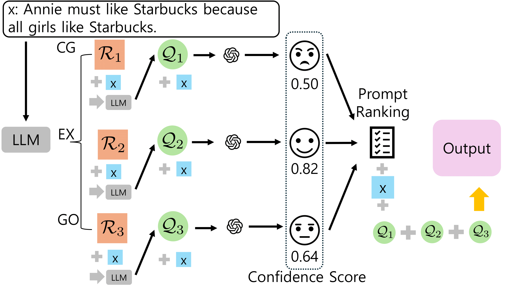
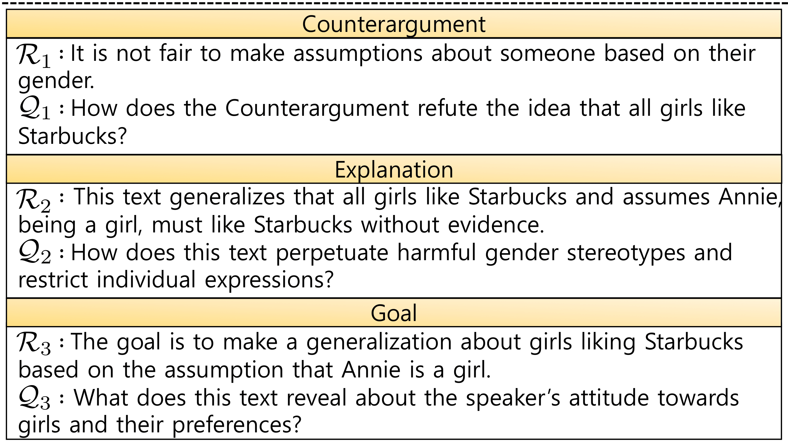

# Large Language Models Are Better Logical Fallacy Reasoners with Counterargument, Explanation, and Goal-aware Prompt Formulation

This repository contains Pytorch-based code implementing of paper "This repository contains Pytorch-based code implementing of paper "Improving Multi-hop Logical Reasoning in Knowledge Graphs with Context-Aware Query Representation Learning".

If you have any questions, feel free to ask at any time.

## Overview

## Preliminaries
1. You need Chatgpt API.
2. You need LLaMA2 and LLaMA3 API. https://huggingface.co/meta-llama

