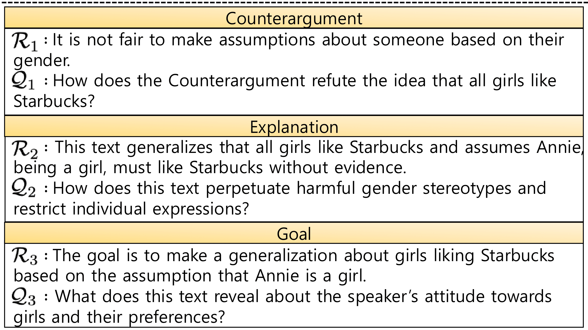

# Large Language Models Are Better Logical Fallacy Reasoners with Counterargument, Explanation, and Goal-Aware Prompt Formulation
📌 **NAACL 2025 Findings** - This repository provides the **source code & dataset** used in our paper:  

**"Large Language Models Are Better Logical Fallacy Reasoners with Counterargument, Explanation, and Goal-Aware Prompt Formulation."** 

📩 If you have any **questions** or **issues**, feel free to ask! 🚀  


## 📖 **Overview** 




## ⚡ **Preliminaries** 

Before running the code, make sure you have access to the following:  

### 🔗 **Required APIs**  
1️⃣ **[ChatGPT API](https://openai.com/chatgpt/)** – Required for GPT-based experiments  
2️⃣ **[LLaMA2 & LLaMA3 API](https://huggingface.co/meta-llama)** – Required for LLaMA-based models  
   

## 📂 **Datasets**  

The original datasets used in our study can be found at the links below: 

| Dataset | Source Link |
|-------------|------|
| **Argotario** | [🔗 Link](https://github.com/UKPLab/argotario/blob/master/data/arguments-en-2018-01-15.tsv) |
| **Logic (edu_train, edu_dev, edu_test)** | [🔗 Link](https://github.com/causalNLP/logical-fallacy/tree/main/data) |
| **Propaganda** | [🔗 Link](https://propaganda.qcri.org/nlp4if-shared-task/data/datasets-v2.tgz) |
| **CLIMATE & COVID-19** | [🔗 Link](https://github.com/Tariq60/fallacy-detection/tree/master/data) |

📌 **Preprocessed datasets** can be found in the `data` folder.


## ⚙️ **Generating Augmented Data** 

To generate Contextual Augmentation, run:

```
python make_case.py
```

To generate Reformulated Queries, run:

```
python make_case_query.py
```


## 🚀 **How to Run the Code**

Before running the experiments, create a result directory.

📂 All results will be saved as text files in this result directory.


### 1️⃣ **Running GPT-Series Models**

```
python fallacy_gpt_{data/...}.py
```

🔹 {data/...} includes PROPAGANDA, ARGOTARIO, LOGIC, CLIMATE, and COVID-19.

### 2️⃣ **Running LLaMA-Series Models**

```
python fallacy_llama3_{data/...}.py
```
🔹 {data/...} includes PROPAGANDA, ARGOTARIO, LOGIC, CLIMATE, and COVID-19.

### 3️⃣ **Running RoBERTa-Base Fine-Tuning**

```
python fine-tune-LM_concat_{data/...}.py
```

🔹 {data/...} includes PROPAGANDA, ARGOTARIO, LOGIC, CLIMATE, and COVID-19.

## 📜 **Citation** 

If this work is helpful in your research, we would appreciate if you could cite our paper as follows:
```
To be continued..
```

