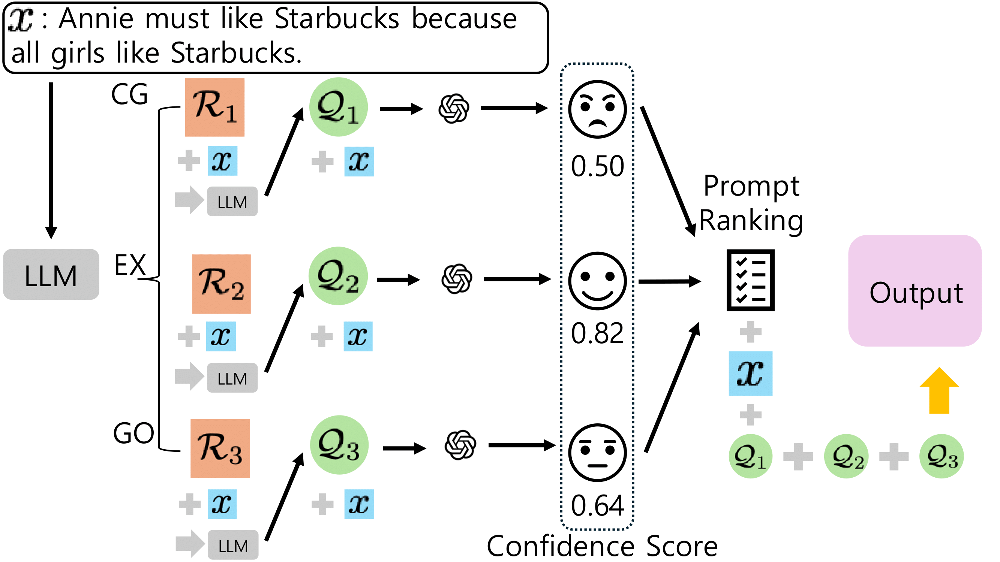

# Large Language Models Are Better Logical Fallacy Reasoners with Counterargument, Explanation, and Goal-Aware Prompt Formulation

This repository contains Pytorch-based code implementing of paper "This repository contains Pytorch-based code implementing of paper "Large Language Models Are Better Logical Fallacy Reasoners with Counterargument, Explanation, and Goal-Aware Prompt Formulation" (NAACL 2025).

If you have any questions, feel free to ask at any time.


## Overview




## Preliminaries
1. You need [Chatgpt API](https://openai.com/chatgpt/).
   
2. You need [LLaMA2 and LLaMA3 API](https://huggingface.co/meta-llama).
   

## Datasets

The original datasets can be found at the links below.

| Dataset      | Link |
|-------------|------|
| **Argotario** | [Link](https://github.com/UKPLab/argotario/blob/master/data/arguments-en-2018-01-15.tsv) |
| **Logic (edu_train, edu_dev, edu_test)** | [Link](https://github.com/causalNLP/logical-fallacy/tree/main/data) |
| **Propaganda** | [Link](https://propaganda.qcri.org/nlp4if-shared-task/data/datasets-v2.tgz) |
| **CLIMATE & COVID-19** | [Link](https://github.com/Tariq60/fallacy-detection/tree/master/data) |


The preprocessed datasets are located in the data folder.

To generate Contextual Augmentation, run:

```
python make_case.py
```

To generate Reformulated Queries, run:

```
python make_case_query.py
```


## How to run:

Before running the code, create a `result` directory. The results will be saved as text files in this `result` directory.


### GPT Series

```
python fallacy_gpt_{data/...}.py
```
{data/...} includes PROPAGANDA, ARGOTARIO, LOGIC, CLIMATE, and COVID-19.

### LLama Series

```
python fallacy_llama3_{data/...}.py
```
{data/...} includes PROPAGANDA, ARGOTARIO, LOGIC, CLIMATE, and COVID-19.

### Roberta-base

```
python fine-tune-LM_concat_{data/...}.py
```
{data/...} includes PROPAGANDA, ARGOTARIO, LOGIC, CLIMATE, and COVID-19.


